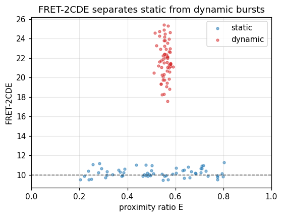

# FRET-2CDE / ALEX-2CDE burst dynamics

## What it does

Single-molecule FRET bursts from freely-diffusing molecules can hide **sub-burst
dynamics**: a molecule that inter-converts between two FRET states while crossing
the confocal spot produces one burst with an intermediate apparent efficiency,
indistinguishable — on the E histogram alone — from a genuinely static
intermediate state. **2CDE** (two-channel kernel density estimator; Tomov et
al., *Biophys. J.* 2012) flags these dynamic bursts without a kinetic model.

For every photon a kernel-density estimate of the local donor and acceptor
brightness is formed (Laplace kernel, time constant `τ`), and per burst

$$\mathrm{FRET\text{-}2CDE} = 110 - 100\,\big[(E)_D + (1-E)_A\big].$$

A **static** burst gives ≈ 10; a burst with millisecond dynamics rises to 30–100.
**ALEX-2CDE** is the analogous quantity for ALEX/PIE data and flags acceptor
blinking / donor-only contamination.

## In ChiSurf

The computation is the `tttrlib.TwoCDE` burst feature (a bit-exact port of the
FRETBursts reference, parallel over bursts). It is wrapped by the `burst_2cde`
plugin, exposed as a `2cde compute` CLI, the `burst_2cde.jobs.compute` RPC
service, and the guided-workflow one-liner `Bursts.two_cde(...)`.

```python
import numpy as np
import tttrlib

# One in-memory TTTR with donor (ch 0) and acceptor (ch 1) photons, one row per burst.
eng = tttrlib.TwoCDE(tttr)
eng.set_donor([0])
eng.set_acceptor([1])
eng.compute(burst_bounds, tau=40e-6, variant=tttrlib.TwoCDE.FRET_2CDE,
            kernel=tttrlib.TwoCDE.LAPLACE)
fret_2cde = eng.two_cde          # one value per burst; NaN if a stream is empty
```

From the guided burst workflow:

```python
bursts = workflow.select_bursts(...)
res = bursts.two_cde(donor="green", acceptor="red", tau=100e-6, variant="fret")
res.dynamic_fraction(threshold=12.0)   # fraction of bursts flagged dynamic
res.plot()
```

## Result

Static bursts (constant acceptor probability) and dynamic bursts (alternating
between low and high FRET within each burst) were simulated and their FRET-2CDE
computed. The static population sits on the ≈ 10 baseline across all efficiencies;
the dynamic population is clearly elevated.



## See also

- Plugin: `chisurf/plugins/burst/burst_2cde/`
- Engine: `tttrlib.TwoCDE` (base class `tttrlib.BurstFeature`)
- The complementary variance-based dynamics test: Burst Variance Analysis (`burst_bva`).
