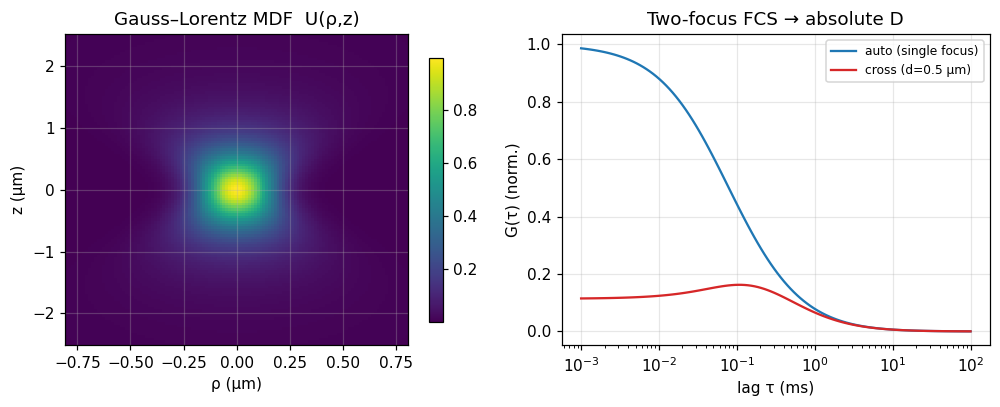

# Enderlein MDF & two-focus FCS

## What it does

The ordinary FCS models approximate the confocal detection volume by a 3-D
Gaussian, which is only a rough description of a real confocal spot. The
**molecule-detection function** (MDF; Enderlein et al., 2005) is a more faithful,
semi-analytic profile — a **Gauss–Lorentz** shape built from the overlap of a
Gaussian excitation beam and a Gaussian-imaged pinhole, whose lateral width and
collection efficiency vary with axial position:

$$U(\rho,z) = \frac{\kappa(z)}{w(z)^2}\,e^{-2\rho^2/w(z)^2}\Big/\text{norm}.$$

It yields an accurate **effective volume**
$V_\text{eff}=\pi(\int\kappa\,dz)^2/\int(\kappa^2/w^2)\,dz$ — hence absolute
concentrations — and the diffusion autocorrelation without the Gaussian
approximation.

**Two-focus FCS** cross-correlates two foci a *known* distance `d` apart. The
lateral overlap of the two MDFs is attenuated by
$\exp[-d^2/(4D\tau + (w^2+w'^2)/2)]$, which decays with lag and yields an
**absolute** diffusion coefficient calibrated by `d` (no separate volume
calibration).

## In ChiSurf

```python
import numpy as np
from chisurf.core.fluorescence.fcs import enderlein as en

tau = np.logspace(-6, -1, 120)               # seconds
auto  = en.g_diff(tau, w0=0.25, R0=0.25, diffusion=300.0, separation=0.0)
cross = en.g_diff(tau, 0.25, 0.25, diffusion=300.0, separation=0.5)   # 0.5 µm apart

veff = en.effective_volume(0.25, 0.25)       # µm^3  ->  absolute concentration
```

The diffusion autocorrelation is obtained by convolving the MDF with the 3-D
diffusion propagator; the lateral integral is analytic and the axial convolution
uses Gauss–Hermite quadrature in the difference direction, so the propagator is
resolved at any lag. The model is available as the non-parse fit model **“FCS
MDF (Gauss–Lorentz)”** in the FCS experiment, with `N`, `D`, `w0`/`R0`, the fixed
optics, and the two-focus `diam` parameter (`0` = single-focus auto-correlation).

## Result

**Left:** the Gauss–Lorentz MDF $U(\rho,z)$ — the confocal detection profile,
elongated along the optical axis. **Right:** the single-focus autocorrelation
(blue) and the two-focus cross-correlation (red); the cross-correlation is
suppressed at short lag and peaks at a finite lag set by the transit time between
the foci — the signature that fixes an absolute `D`.



## See also

- `chisurf/core/fluorescence/fcs/enderlein.py` (`mdf`, `effective_volume`, `g_diff`, `acf`)
- Model: `chisurf/core/models/fcs/mdf.py` (`MdfFCSModel`, table-view `mdf.view.json`), and the
  general composable model `chisurf/core/models/fcs/general.py` (`GeneralFCSModel`), which lets
  you pick MDF vs. classic 3D-Gaussian diffusion and add bunching/anticorrelation terms.
