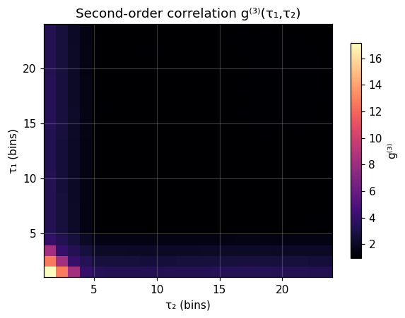

# ns-FCS second-order correlation

:::{admonition} Theory
:class: seealso
See {ref}`concept-fcs-correlation` for the correlation function and the photon-antibunching / ns-FCS regime.
:::

## What it does

The ordinary (pair) correlation function $g^{(2)}(\tau)$ measures two-photon
coincidences. Some dynamics — higher-order kinetics, and the distinction between
a genuinely three-state process and a mixture — only show up in the
**second-order (three-photon) correlation**

$$g^{(3)}(\tau_1,\tau_2) =
\frac{\langle I(t)\,I(t+\tau_1)\,I(t+\tau_1+\tau_2)\rangle}
     {\langle I\rangle\,\langle I'\rangle\,\langle I''\rangle}.$$

It equals `1` for an uncorrelated (Poisson) stream and departs from `1` where
three-photon correlations are present — the observable used in ns-FCS to resolve
higher-order photon statistics beyond the pair correlation.

## In ChiSurf

```python
import numpy as np
from chisurf.core.fluorescence.fcs.correlate import second_order_correlation

tau1 = np.arange(1, 25)      # lag grids (in bins)
tau2 = np.arange(1, 25)
g3 = second_order_correlation(binned_trace, tau1, tau2)   # (len(tau1), len(tau2))

# Cross-g^(3) across three channels:
g3_x = second_order_correlation(trace_a, tau1, tau2, trace2=trace_b, trace3=trace_c)
```

The input is a binned intensity trace (auto-correlation) or three channel traces
(cross-correlation); fine binning of a photon stream gives the ns-scale lags.

## Result

A Poisson trace with injected short, correlated bursts. $g^{(3)}$ is strongly
elevated at short $(\tau_1,\tau_2)$ — the three-photon bunching signature — and
decays to ≈ 1 as either lag grows beyond the burst width.



## See also

- `chisurf/core/fluorescence/fcs/correlate.py` (`second_order_correlation`)
- The pair-correlation machinery in the same module (`correlate`, `log_corr`, `make_fine`).
