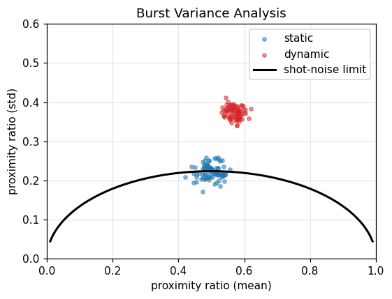

# Burst Variance Analysis (BVA)

## What it does

**BVA** (Torella et al., *Biophys. J.* 2011) is a model-free test for sub-burst
FRET dynamics, complementary to [2CDE](01_fret_2cde.md). Each burst is split into
short slices of a few photons, the proximity ratio is computed for every slice,
and the **standard deviation** of the slice proximity ratios is taken per burst.

For a genuinely **static** species the only source of slice-to-slice variation is
shot noise, so the standard deviation follows the analytic shot-noise line
$\sigma = \sqrt{p(1-p)/n}$ (for $n$ photons per slice at proximity ratio $p$). A
**dynamic** species that inter-converts within the burst scatters **above** that
line.

## In ChiSurf

The engine is the `tttrlib.BVA` burst feature (parallel over bursts); the
`burst_bva` plugin wraps it, and it is a step in the guided burst workflow.

```python
import numpy as np
import tttrlib

bva = tttrlib.BVA(tttr)
bva.set_donor([0])                 # donor routing channels
bva.set_acceptor([1])              # acceptor routing channels
bva.compute(burst_bounds, number_of_photons_per_slice=5, minimum_window_length=0.01)

mean = bva.proximity_ratio_mean    # per burst
std  = bva.proximity_ratio_std

# the analytic shot-noise line to overlay
grid = np.linspace(0.01, 0.99, 200)
_, shot_noise_std = tttrlib.BVA.compute_static_bva_line(grid, number_of_photons_per_slice=5)
```

From the guided workflow: `bursts.bva("green", "red", photons_per_slice=5)`
returns a `Bva` result with `.dynamic_fraction` and `.plot()`.

## Result

Simulated static bursts (constant acceptor probability) fall on the shot-noise
limit, while dynamic bursts (alternating high/low FRET within each burst) sit
clearly above it.



## See also

- Engine `tttrlib.BVA` (base class `tttrlib.BurstFeature`); plugin `chisurf/plugins/burst/burst_bva/`.
- The kernel-density dynamics test: [FRET-2CDE](01_fret_2cde.md).
