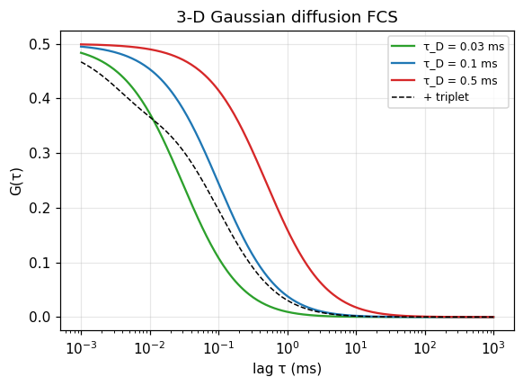

# Diffusion FCS

## What it does

**Fluorescence correlation spectroscopy** measures the temporal autocorrelation
of the fluorescence fluctuations as molecules diffuse through the confocal
volume. The correlation amplitude gives the mean number of molecules $N$ (hence
the concentration), and the decay time gives the diffusion time $\tau_D$ (hence
the diffusion coefficient / hydrodynamic radius). Fast photophysics (triplet
blinking) adds a short-lag shoulder.

For a 3-D Gaussian detection volume with structure parameter $s = z_0/w_0$,

$$G(\tau) = \frac{1}{N}\,\frac{1}{1+\tau/\tau_D}\,
           \frac{1}{\sqrt{1+(\tau/\tau_D)/s^2}}\,
           \big(1 - a_T + a_T e^{-\tau/\tau_T}\big).$$

## In ChiSurf

ChiSurf ships a large catalogue of correlation-curve fit models
(`chisurf/core/models/fcs/models.yaml`) — 3-D/2-D Gaussian diffusion with one or
more components, triplet/bunching terms, flow, anomalous diffusion, two-focus,
FRET-FCCS, ns-FCS antibunching, and scanning FCS — fitted in the **FCS
experiment**. Correlation curves are computed from TTTR data by the
`fcs_correlator` plugin (multi-tau, with optional fine/ns-scale correlation),
and the [Enderlein MDF model](05_enderlein_mdf_two_focus_fcs.md) provides the
non-Gaussian, absolute-volume alternative.

```python
import numpy as np

def g_3d_gauss(tau, N, td, s, trip_a=0.0, trip_t=1e-6):
    g = (1.0 / N) / (1 + tau / td) / np.sqrt(1 + (tau / td) / s ** 2)
    return g * (1 - trip_a + trip_a * np.exp(-tau / trip_t))

tau = np.logspace(-6, 0, 300)          # seconds
G = g_3d_gauss(tau, N=2.0, td=1e-4, s=5.0, trip_a=0.2, trip_t=3e-6)
```

## Result

The 3-D Gaussian diffusion correlation for three diffusion times (faster
diffusion → shorter decay), and the effect of adding a triplet term (dashed): a
short-lag rise above the diffusion plateau.



## See also

- Model catalogue: `chisurf/core/models/fcs/models.yaml`; correlator: `chisurf/plugins/fcs/fcs_correlator/`.
- Absolute concentrations & two-focus: [Enderlein MDF & two-focus FCS](05_enderlein_mdf_two_focus_fcs.md).
- Higher-order statistics: [ns-FCS second-order correlation](06_nsfcs_second_order.md).
