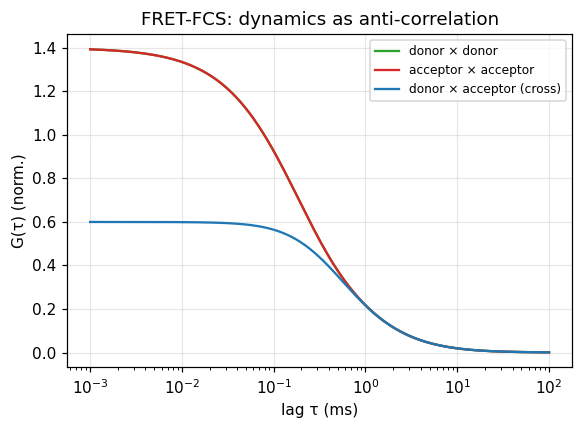

# FRET-FCS

:::{admonition} Theory
:class: seealso
See {ref}`concept-fcs-correlation` for the correlation function and FRET-FCCS kinetics.
:::

## What it does

Correlating the donor and acceptor signals of freely-diffusing FRET molecules
adds **dynamics** information to FCS. If the molecule inter-converts between FRET
states while in the focus, the donor and acceptor intensities fluctuate in
**anti-phase** (more FRET → less donor, more acceptor). So on top of the
diffusion decay:

- the donor and acceptor **auto-correlations** show a positive relaxation
  (bunching) term at the exchange time,
- the donor–acceptor **cross-correlation** shows a negative (anti-correlated)
  term at the same time.

The relaxation time gives the sum of the forward and backward rate constants,
independent of the (much slower) diffusion time.

## In ChiSurf

```python
# correlate two photon streams (donor, acceptor) with the FCS correlator, then
# fit the auto/cross curves globally with the FRET-FCCS models in models.yaml.
from chisurf.core.fluorescence.fcs.correlate import correlate
# G_dd, G_aa, G_da  ->  fit sharing the exchange rate k = k12 + k21
```

The FCS model catalogue includes explicit 2-state FRET-FCCS kinetic models
(`FRET-FCCS, 2-state (D)`); the correlator plugins compute the auto/cross curves
from the burst or full photon streams.

## Result

Donor and acceptor auto-correlations (positive relaxation) and the
donor–acceptor cross-correlation (anti-correlated dip) riding on the common
diffusion decay — the FRET-FCS signature of conformational exchange.



## See also

- FCS models `chisurf/core/models/fcs/models.yaml`; [Diffusion FCS](09_diffusion_fcs.md).
