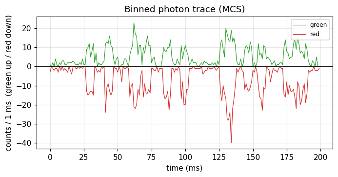

# Binned photon traces (MCS)

## What it does

Binning the photon stream into fixed time windows (multi-channel scaler, MCS,
traces) is the simplest view of the data and the input to intensity-based
methods: burst search, time-trace inspection, camera-style HMM
([ebFRET](20_ebfret_binned_hmm.md)), photon-counting histograms
([FIDA](04_fida_pch.md)), and coincidence analysis. Overlaying the green and red
detectors shows coincident FRET bursts at a glance.

## In ChiSurf

```python
import numpy as np

bin_s = 1e-3
edges = np.arange(0, macro_times[-1] * macro_res, bin_s)
green = np.histogram(macro_times[route == 0] * macro_res, edges)[0]
red   = np.histogram(macro_times[route == 1] * macro_res, edges)[0]
```

The `trace_browser` / `tttr_image_browser` tools and the burst-selection preview
build and display these traces (with adjustable bin time and micro-time gating)
directly from TTTR data.

## Result

A 1 ms-binned green/red intensity trace (green up, red down); the coincident
green+red spikes are single-molecule FRET bursts.



## See also

- `chisurf/plugins/tttr/trace_browser/`; the burst search consumes these traces ([burst identification](13_burst_identification.md)).
