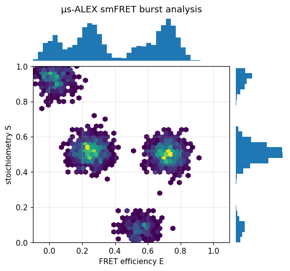

# A complete µs-ALEX smFRET burst-analysis workflow

:::{admonition} Theory
:class: seealso
The burst-analysis theory behind this workflow — burst search, accurate $E$/$S$,
and the leakage/direct-excitation/$\gamma$/$\beta$ corrections — is in the
concept page {ref}`concept-smfret-bursts`.
:::

This tutorial walks the full end-to-end pipeline for freely-diffusing
single-molecule FRET with alternating-laser excitation (µs-ALEX), the way a
typical analysis notebook is structured — but using ChiSurf's guided
`BurstWorkflow` facade, where each step is one plain-English line.

## The steps

1. **Load** the TTTR data (PTU/HT3/Photon-HDF5) and declare the detector setup.
2. **Corrections** — leakage, direct excitation, γ (and β for stoichiometry).
3. **Background** — estimate the per-detector rate from the inter-photon-time tail.
4. **Burst search** — sliding window (min photons L, window m, threshold factor F).
5. **E–S histogram** — the 2-D map, gating out donor-only / acceptor-only.
6. **Select** the FRET sub-population(s) and **fit** the FRET histogram.

## In ChiSurf

```python
from chisurf.plugins.burst.burst_analysis.api.workflow import BurstWorkflow, Setup

wf = BurstWorkflow()
wf.connect()                                     # or wf.demo() for bundled data
h = wf.register("measurement.ptu")               # -> MMFDB

setup = Setup.from_channels(green=(0, 8), red=(1, 9), yellow=(2, 10))   # ALEX/PIE
bursts = wf.select_bursts(h, setup=setup, method="burst", min_photons=20)

# derived observables + downstream analyses, each a one-liner:
bursts.two_cde("green", "red")                   # dynamics filter  (tutorial 1)
bursts.bva("green", "red")                       # variance analysis (tutorial 8)
bursts.recurrence("green", "red")                # slow kinetics     (tutorial 2)
```

The correction factors are managed by `chisurf/core/fluorescence/fret/calibration.py`
(see [tutorial 14](14_multiparameter_es.md)); the background by
[tutorial 15](15_background_rates.md); and the burst search by
[tutorial 13](13_burst_identification.md). `BurstWorkflow.simulate(fret=…,
exchange_rate=…)` generates a known-ground-truth ALEX dataset to validate the
whole pipeline.

## Result

The µs-ALEX $E$–$S$ jointplot: two FRET populations at mid stoichiometry, plus
the donor-only ($S\to1$) and acceptor-only ($S\to0$) species that the
stoichiometry gate removes. The marginal histograms are the projected $E$ and
$S$ distributions.



## See also

- Guided facade: `chisurf/plugins/burst/burst_analysis/api/workflow.py`.
- Population selection: [tutorial 28](28_selecting_fret_populations.md); histogram fitting: [tutorial 29](29_fret_histogram_fitting.md).
