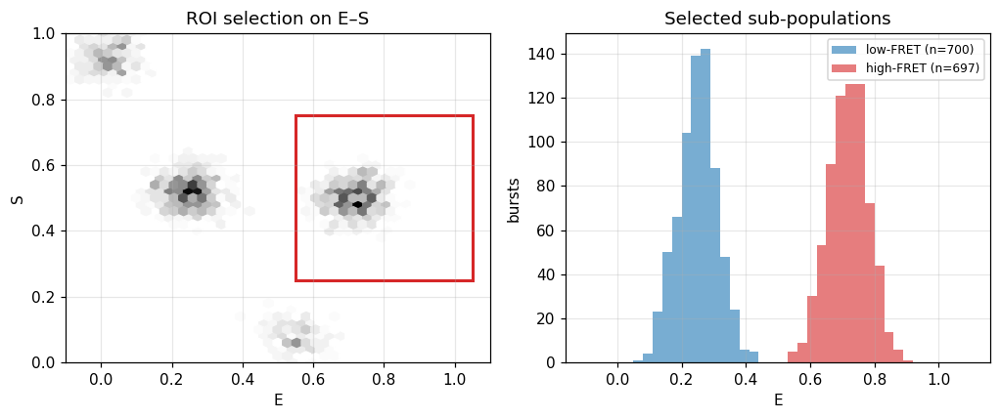

# Selecting and comparing FRET populations

## What it does

A single measurement usually contains several sub-populations — different FRET
states, donor-only, aggregates. **Selecting** a population means gating bursts by
one or more observables: stoichiometry $S$ (to keep doubly-labelled molecules),
burst size (photon count, for signal-to-noise), and a region of interest (ROI)
on the $E$–$S$ map. Comparing the selected sub-populations — their fractions,
FRET efficiencies, burst widths — is how heterogeneity and dynamics are
quantified. A two-color (DCBS) burst search can additionally enrich the
doubly-labelled species.

## In ChiSurf

`Bursts.table` is a pandas DataFrame, so selection is ordinary boolean masking on
the per-burst observables, and the `burst_selection` plugin provides an
interactive ROI/gate GUI with a Gaussian-mixture clustering
([tutorial 26](26_2d_peak_fitting.md)).

```python
t = bursts.table
fret = t[(t["S"] > 0.25) & (t["S"] < 0.75) & (t["nphotons"] > 30)]   # doubly-labelled, bright
high = fret[fret["E"] > 0.55]
low  = fret[fret["E"] < 0.45]
ratio = len(low) / len(high)
```

## Result

**Left:** a high-FRET region of interest drawn on the $E$–$S$ map. **Right:** the
FRET-efficiency histograms of the selected high- and low-FRET sub-populations,
ready for comparison of their fractions and positions.



## See also

- `chisurf/plugins/burst/burst_selection/`; the full workflow: [tutorial 27](27_alex_smfret_workflow.md).
