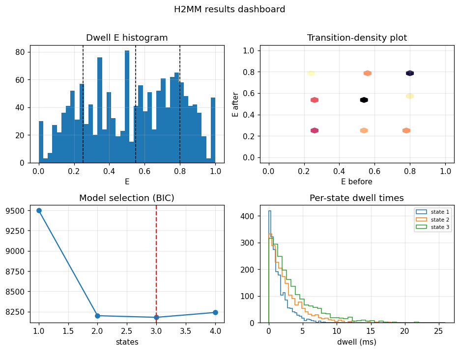

# H2MM: complete workflow and results

Building on [tutorial 19](19_h2mm_hidden_markov.md), this walks the full
photon-by-photon hidden-Markov workflow the way a dedicated H2MM analysis is
structured: **optimise** models for a range of state counts, **select** by
BIC/ICL, then **access the results** and produce the standard plots.

## The steps

```python
from chisurf.plugins.burst.burst_h2mm.core.analysis import analyze

result = analyze(bundle,
                 states=(1, 2, 3, 4),      # scan state counts
                 engine="em",              # or em-float32 / surrogate
                 criterion="bic")          # model selection

# results access
result.n_states                # selected number of states
result.scan                    # BIC/ICL vs state count
result.dwells                  # per-dwell measured E (and S with an Aex stream)
result.transitions             # Viterbi transition-count matrix
result.state_lifetimes         # per-state dwell-time distributions
```

From the guided facade this is simply `bursts.h2mm(states=(1, 2, 3))`. The GUI
runs the fit off the UI thread and updates the plots live after each state-count
fit.

## The results dashboard

The `burst_h2mm` GUI presents six coupled panels; the four essential ones are:

- **Dwell E histogram** — the FRET efficiencies of the Viterbi dwells, peaking at
  the recovered state efficiencies (an E–S scatter when an Aex stream is present).
- **Transition-density plot** — E *before* vs E *after* each transition, showing
  which states inter-convert.
- **Model selection** — BIC/ICL vs number of states; the minimum is the selected
  model.
- **Per-state dwell-time distributions** — the residence times, giving the rates.



## See also

- `chisurf/plugins/burst/burst_h2mm/` (`core/analysis.py`, `gui/tool.py`); theory in `docs/H2MM.md`.
- Uncertainty & simulation validation: [tutorial 31](31_h2mm_simulation_validation.md).
