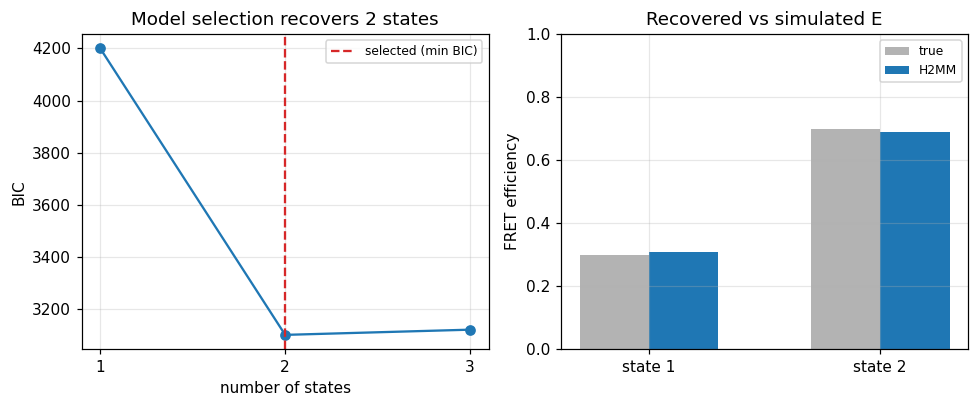

# H2MM: simulating and validating

:::{admonition} Theory
:class: seealso
See {ref}`concept-photophysics-simulation` for how the ground-truth photon
stream is generated and {ref}`concept-h2mm` for the model being validated.
:::

## What it does

Before trusting an H2MM result on real data you validate the whole chain on
**simulated** data with a known number of states, known FRET efficiencies and
known transition rates: simulate the photon stream, run the same
`analyze(...)` you use on measurements, and check that the model-selection
criterion recovers the right number of states and that the fitted efficiencies
and rates match the inputs. This is also how the **uncertainty** of a real fit
is assessed — by bootstrapping (resampling bursts with replacement and refitting)
to get error bars on the per-state E/S and rates.

## In ChiSurf

Simulate a ground-truth dataset (via the tttrlib confocal simulator, see
[tutorial 18](18_tttr_simulation.md)) and analyse it exactly as measured data:

```python
from chisurf.plugins.burst.burst_analysis.api.workflow import BurstWorkflow

wf = BurstWorkflow()
sim = wf.simulate(fret=[0.3, 0.7], exchange_rate=500.0)     # known 2-state ground truth
bursts = wf.select_bursts(sim.handle, setup=sim.setup)
result = bursts.h2mm(states=(1, 2, 3))                      # should select 2 states

# bootstrap uncertainty on a fit
lo, hi = result.bootstrap_uncertainty(n=100)                # per-state E/S percentiles
```

`burst_h2mm` also exposes an `em-float32` fast engine and an optional trained
neural surrogate for large datasets, and its "± Uncertainty" action overlays the
bootstrap error bars on the E–S and E–τ panels.

## Result

**Left:** the BIC drops sharply from 1 to 2 states and rises again at 3 —
correctly selecting the simulated two-state model. **Right:** the FRET
efficiencies recovered by H2MM match the simulated values.



## See also

- `chisurf/plugins/burst/burst_h2mm/core/` (`surrogate.py`, `analysis.py`); the ground-truth simulator: [tutorial 18](18_tttr_simulation.md).
