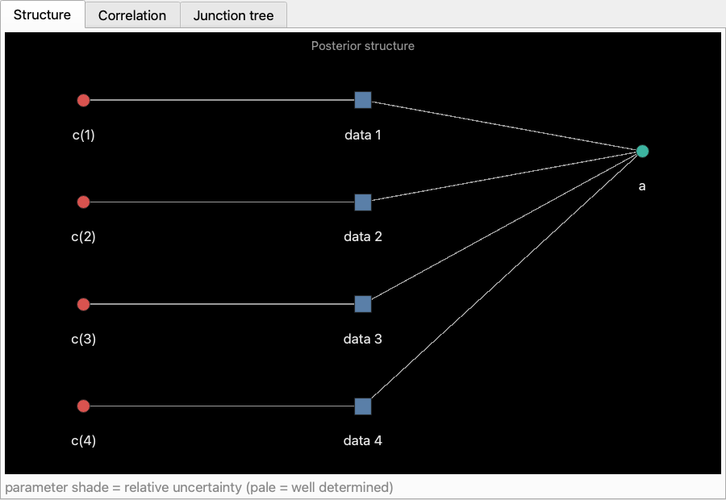
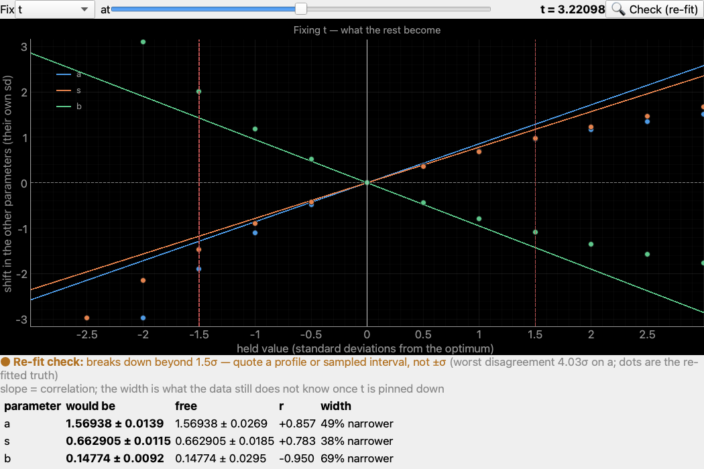
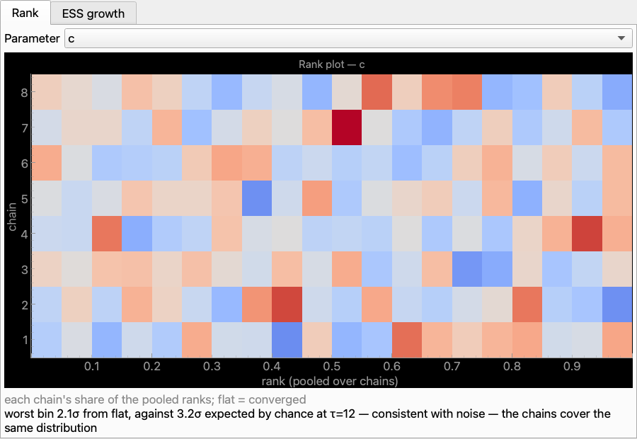

# 39 — Parameter uncertainty: priors, sampling and convergence

**Theory:** [Parameter uncertainty](../concepts/parameter_uncertainty.md) ·
**Code:** `chisurf.core.fitting.priors`, `chisurf.core.fitting.sample`,
`chisurf.core.fitting.diagnostics`

This tutorial turns a converged fit into a defensible uncertainty: attach prior
knowledge, sample the posterior, and check whether the chain is worth quoting.
Everything here runs headless.

## 1. Fit something

```python
import numpy as np
import chisurf.core.data
import chisurf.core.fitting.fit
import chisurf.core.models.parse

rng = np.random.default_rng(0)
x = np.linspace(1.0, 2.0, 96)
y = 1.0 + 2.0 * x + 0.5 * x**2 + rng.normal(0.0, 0.02, x.size)

data = chisurf.core.data.DataCurve(x=x, y=y, ey=np.full_like(y, 0.02))
fit = chisurf.core.fitting.fit.FitGroup(
    data=chisurf.core.data.DataGroup([data]),
    model_class=chisurf.core.models.parse.ParseModel,
)
fit.fit_range = 0, len(fit.model.y)
fit.model.func = 'c+a*x+b*x**2'
fit.model.find_parameters()
fit.run()

print(fit.chi2r)
```

Printing the fit shows the parameter table and, underneath it, the priors in
play and the interval for each parameter with the method that produced it.

## 2. Attach a prior

A prior is set on the parameter. Bounds *are* the uniform prior, so setting one
replaces the other rather than stacking with it.

```python
from chisurf.core.fitting.priors import NormalPrior, LogNormalPrior

params = fit.model.parameters_all_dict
params['c'].prior = NormalPrior(mu=1.0, sigma=0.05)   # independently measured
params['b'].prior = LogNormalPrior(mu=0.0, sigma=1.0)  # positive, order unity
fit.run()   # now maximum-a-posteriori rather than plain least squares
```

Available families: `UniformPrior` (a bound), `NormalPrior`,
`TruncatedNormalPrior`, `HalfNormalPrior`, `LogNormalPrior`,
`ExponentialPrior`, `GammaPrior`, `BetaPrior`, and `CallablePrior` for any
`logpdf(x)` you write yourself. Same-family priors combine in closed form:
`NormalPrior(1.0, 0.1) * NormalPrior(1.1, 0.2)` is one precision-weighted
Gaussian.

`fit.chi2r` still reports the **data** misfit — the prior never inflates or
deflates your goodness of fit.

## 3. Sample the posterior

```python
report = chisurf.core.fitting.fit.sample_fit(
    fit=fit,
    target_directory='./sampling',
    method='blocked',     # correlated proposal; see step 5
    steps=5000,
    thin=1,
    n_runs=4,             # independent runs -> a meaningful R-hat
)
```

This writes a timestamped directory containing the project, `parameters.json`,
a `chains/` folder with one tab-separated file per run, and `diagnostics.json`.
Each chain file has columns `chi2r`, `lnprior`, then one per parameter — the
data misfit and the prior stay separable, so a stored chain can be reweighted
under a different prior without resampling.

Use `n_runs` of at least 2. A single run cannot be compared with anything.

## 4. Read the diagnostics before the answer

```python
for e in report['parameters']:
    print(f"{e['name']:>4s}  {e['mean']:.4f} ± {e['sd']:.4f}   "
          f"ESS={e['ess']:.0f}  R-hat={e['rhat']:.4f}  tau={e['tau']:.1f}")

for w in report['warnings']:
    print('WARNING:', w)
```

```
   c  0.9756 ± 0.0394   ESS=1763  R-hat=1.0025  tau=11.3
   a  2.0305 ± 0.0544   ESS=1780  R-hat=1.0023  tau=11.2
   b  0.4918 ± 0.0184   ESS=1807  R-hat=1.0020  tau=11.0
   warnings: none
```

(`c` sits slightly below the true 1.0 because the `NormalPrior(1.0, 0.05)` from
step 2 is pulling on it — that is the prior doing its job, and `a` and `b` shift
to compensate along the correlated direction.)

Reject the run and sample longer if any parameter has **R-hat > 1.01** or
**ESS < 400**. The warnings list says which parameter and by how much; it is
also written to the log and repeated in `print(fit)`.

An empty warnings list means *nothing detectably wrong* — not *correct*.

Once a chain passes, `fit.posterior_summary()` quotes credible intervals from
it, labelled `mcmc`. A chain that failed its checks is **not** quoted: you get
the profile or covariance interval instead, and the failure appears in the
report.

```python
for e in fit.posterior_summary(p_value=0.68):
    print(e['name'], e['low'], e['high'], e['method'])
```

## 5. Choosing a sampler

| `method` | Use when |
| --- | --- |
| `collapsed` | a **linked** global fit — integrates each dataset's private parameters out and samples only the shared ones |
| `blocked` | correlated parameters, unlinked groups, single decays |
| `emcee` | many well-scaled parameters, or as an independent cross-check |
| `mcmc` | only for an uncorrelated, well-conditioned posterior |

On a deliberately collinear three-parameter fit, effective samples per 1000
model evaluations: `blocked` 64, `emcee` 26, `mcmc` 0.4. The diagonal proposal
of `mcmc` produced 4 effective samples out of 8000 draws — it is kept for
compatibility, not recommended.

## 6. Global fits

`FitGroup.model` is the **selected member's** model, so `sample_fit` on a group
samples that member. To sample the joint posterior of every dataset, ask for it:

```python
report = chisurf.core.fitting.fit.sample_fit(
    fit=group_fit,
    target_directory='./sampling',
    method='blocked',          # required for global_posterior
    steps=5000,
    n_runs=2,
    global_posterior=True,     # the joint posterior, not one member
)
```

Parameter names are then the group's prefixed ones (`1:c`, `1:a`, `2:c`, …).

With `method='blocked'` ChiSurf first checks whether the fit splits into
**independent components** — datasets sharing no parameter. If it does, each
component is sampled on its own and the results merged analytically (see the
[concept page](../concepts/parameter_uncertainty.md#dont-sample-what-doesnt-need-sampling-together)).
On 8 unlinked datasets this gave 7.8× the effective sample size for 40% fewer
model evaluations. If every dataset shares a parameter, there is one component
and one joint chain — nothing is lost, nothing is gained.

For finer control, drive the sampler directly:

```python
from chisurf.core.fitting import factorgraph
import chisurf.core.fitting.sample

joint = factorgraph.posterior_model(fit)   # the global model
joint.update_model()
r = chisurf.core.fitting.sample.walk_mcmc_blocked(
    fit=fit, steps=5000, step_size=0.02, thin=1, model=joint
)
print(r['parameter_names'], r['block_sizes'])
# ['1:c', '1:a', '2:c', '3:c', '4:c']   [1, 1, 1, 1, 1]
```

Blocks come from the fit's factor structure: each dataset's private parameters
form one block, the shared ones another. `r['block_acceptance']` reports the
acceptance of each, which is what tells you a particular block is badly scaled.

## 7. Linked global fits: use `collapsed`

Linking a parameter across datasets *reduces* the dimension but makes the
posterior **harder** to sample — the shared parameter is correlated with every
dataset's private ones. `collapsed` integrates the private parameters out
analytically and samples only the shared ones:

```python
report = chisurf.core.fitting.fit.sample_fit(
    fit=group_fit, target_directory='./sampling',
    method='collapsed', steps=3000, n_runs=2, global_posterior=True,
)
```

With three private parameters per dataset this gave 26× the effective samples
per model evaluation of `blocked` — and the `blocked` run's error bar on the
shared parameter was 5.6× too small, an under-sampled result that only the ESS
diagnostic exposed. Exact when the private parameters enter linearly
(amplitudes, offsets, scatter fractions); otherwise check against `blocked`.

With one private parameter per dataset the two are about even, so `blocked` is
fine there.

## 8. Inspecting the structure of a global fit

```python
print(joint.structure_report())
```

```
variables      : 5
likelihoods    : 4
treewidth      : 1
components     : 1
separators     : {1:a}
```

Read this as: five free parameters over four datasets, coupled only through
`1:a`. Fix that one parameter and the datasets become independent — which is
exactly the identifiability claim a global fit is making.

`components > 1` means the "global" fit is really several unrelated fits, and
nothing is being shared.

## 9. Reusing a chain under a different prior

Sampling is the expensive part, and "what if I had assumed a tighter prior?" is
the question that usually follows it. You do not have to run it again: the
likelihood is identical under both priors and cancels, so the draws can be
*reweighted*. No model is evaluated.

```python
from chisurf.core.api import ChiSurfAPI

api = ChiSurfAPI()
r = api.reweight_prior(
    {'tau1': {'kind': 'normal', 'mu': 4.0, 'sigma': 0.2}},
    fit_index=0,
)
r['reliable']                    # True if the answer can be used
r['pareto_k']                    # the diagnostic; above 0.7 means it cannot
[e['mean'] for e in r['parameters']]
```

Only the parameters you name enter the ratio — every other prior cancels too.
Pass `None` to *remove* a prior and see the likelihood-only posterior.

**Always read `reliable` before the numbers.** If the new prior favours a region
the chain never explored, a handful of draws carry all the weight and the result
is noise wearing a confident face. That is what `pareto_k` detects:

| `pareto_k` | what to do |
| --- | --- |
| below 0.5 | use it |
| 0.5 – 0.7 | use it, but treat the tail quantiles with caution |
| above 0.7 | **discard it and sample again** under the new prior |

The same is available over RPC as `fit.reweight_prior`. It needs a stored chain,
so run a sampling job first; a fit that has never been sampled returns an error
rather than an invented answer.

## 10. Looking at the posterior instead of reading about it

Two plots are attached to every fit.

**Posterior graph** shows the structure — which datasets constrain which
parameters, whether the fit separates, and which parameters are really one
measurement.



Four datasets, each with its own private `c`, all sharing `a`. Node shade is
relative uncertainty: `a` is pale because four datasets constrain it, the `c`s
are red because one each does. The other two tabs show the posterior
*correlation* (a pair at ±1 is one measurement, not two) and the *junction tree*.

**What-if** answers the question a correlated fit provokes: *if this parameter
really were that value, what would the others have to be?* Pick a parameter,
drag the slider, and read the rest off in their own units. Dragging is free —
for a Gaussian posterior each answer is a matrix update, so the whole curve came
from one curvature evaluation and no model is evaluated at all.

The plot is drawn in standardised units, where **the slope of each line is the
correlation**: a line at 45° means the two parameters move one-for-one and the
data cannot tell them apart. The table underneath gives the real numbers, and
the last column is the useful one — how much narrower a parameter becomes once
the swept one is pinned down. A parameter that goes 90 % narrower was never
really measured independently.

Those straight lines are exact **only if the posterior is Gaussian**, and in
fluorescence it often is not: lifetimes, amplitudes, distances and FRET
efficiencies are all bounded below, and a weak component sits near its bound.
Press **🔍 Check (re-fit)** and the sweep is redone the honest way — hold the
parameter, re-optimise everything else, repeat — and the result is overlaid as
dots.



Near the optimum the dots sit on the lines. Past the red markers they do not,
and the verdict says so: *breaks down beyond 1.5σ — quote a profile or sampled
interval, not ±σ*. On this fit the worst disagreement is **4σ**, so a ±σ error
bar taken from the curvature would be badly wrong two standard deviations out
while looking perfectly respectable.

Read the verdict as a *range*, not a yes/no. A posterior is nearly always
Gaussian close enough to the optimum; what matters is whether that region covers
the interval you intend to quote.

Both sweeps are available headlessly:

```python
from chisurf.core.fitting import engine

eng = engine.GaussianEngine(fit).add_all_targets().run()
approx = eng.conditional_scan('tau1', points=61, span=3.0)      # free
exact = eng.exact_conditional_scan('tau1', points=13, span=3.0)  # one fit/point
print(engine.gaussian_validity(approx, exact)['verdict'])

for t in approx['targets']:
    print(t['name'], t['correlation'], t['marginal_sd'], '->', t['sd'])
```

**Chain diagnostics** shows whether the chain can be believed.



Each row is a chain, each column a rank bin, and the colour is the departure
from flat. An even field means the chains sample the same distribution; a chain
favouring one end of the range appears as a coloured band across its row. The
verdict underneath is calibrated against what noise alone produces for a
histogram of that size *and* the chain's own autocorrelation — so "consistent
with noise" means it, and a warning is worth acting on. The second tab plots
effective sample size against draws, which should grow in a straight line.

Every symmetric interval carries this check automatically once a chain exists.
`posterior_summary()` rows, and the `diagnostics` of any `laplace` or `gaussian`
marginal, gain a `warning` when the chain shows the posterior is skewed:

```python
for row in fit.posterior_summary():
    if row.get('warning'):
        print(row['name'], row['warning'])
# b posterior is skewed (0.1447 +0.0329 -0.026); a symmetric interval
#   misstates both ends
```

No chain means no warning — which is *not* a claim that the posterior is
symmetric, only that nothing has checked.

## 11. In the GUI

The **Sampling** button on the fit controller runs the same code on the server.
The backend comes from `optimization.sampling.method` in the settings
(`blocked` by default); `n_runs` and `steps` come from the controller.

When the job finishes, its **convergence verdict is written to the log** — the
warnings if the chain is not usable, otherwise a one-line all-clear. A finished
job is not the same as a trustworthy one, so do not treat the progress bar
reaching 100 % as a result. The full report is in `diagnostics.json` in the
output folder either way.

Programmatically the same verdict comes back from the job status:

```python
status = client.sampling_status(job_id)
status['status']      # 'completed'
status['converged']   # False if R-hat / ESS checks failed
status['warnings']    # what went wrong, per parameter
status['diagnostics'] # the full per-parameter report
```

## 12. Asking directly, without picking an estimator first

```python
from chisurf.core.fitting import engine

eng = engine.get_engine('auto', fit, use=('laplace', 'mcmc'))
eng.add_all_targets()
eng.run(steps=5000, n_runs=2)

for m in eng.marginals():
    lo, hi = m.interval(0.68)
    print(f"{m.name}: {m.value:.4f}  [{lo:.4f}, {hi:.4f}]  ({m.method})")
```

`auto` runs the estimators you allow and takes, per parameter, the best answer
that actually worked — labelled with which one that was. `laplace` costs
nothing, `profile` costs a re-fit per scan point, `mcmc` costs a sampling run;
`stored` costs nothing at all and reports only what is already there.

## 13. From a script, a macro or the server

The same query is on the stable API facade, so it works from the QtConsole, a
macro, a plugin, the CLI, and over RPC:

```python
from chisurf.core.api import ChiSurfAPI
api = ChiSurfAPI()

r = api.posterior(engine='stored')          # what is already known — free
for m in r['marginals']:
    print(m['name'], m['value'], m['low'], m['high'], m['method'])

r = api.posterior(engine='laplace', joint=['tau1', 'x1'])
print(r['joint']['correlation'])
print(r['log_evidence'])

# Fix a parameter and re-optimise the rest, then ask about another.
r = api.posterior(engine='laplace', condition={'tau2': 4.0}, targets=['tau1'])
```

Over the wire it is the `fit.posterior` RPC with the same arguments. `stored`
and `laplace` return immediately; `profile` and `mcmc` block for as long as they
take, so use the `fit.sample.*` / `fit.parameter_scan.*` job endpoints when you
need to poll progress.

## Checklist

- [ ] Priors reflect knowledge you actually have, not a convenience.
- [ ] `n_runs >= 2`.
- [ ] Every parameter R-hat < 1.01 and ESS > 400.
- [ ] `warnings` empty.
- [ ] Rank plot even, and ESS growing in a straight line.
- [ ] Intervals quoted with their `method`.
- [ ] Any reweighted answer checked for `reliable` / `pareto_k` before use.
- [ ] No parameter quoted as independently measured that **What-if** shows
      collapsing when another is fixed.
- [ ] For any interval wider than the re-fit check says the Gaussian holds:
      quote a `profile` or `mcmc` interval, not `±σ`.
