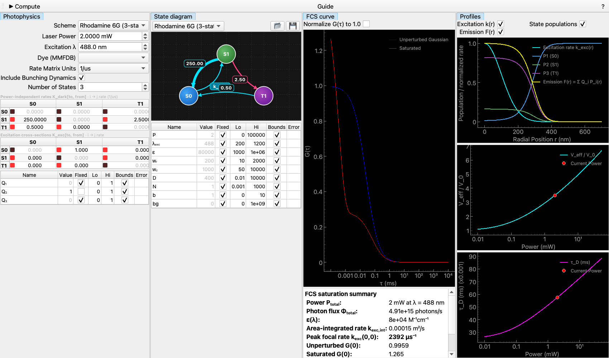

# FCS saturation and focal-volume expansion

**Tool:** Calculators → FCS Saturation · **CLI:** `csg_fcs_saturation` /
`python -m chisurf.plugins.calculator.fcs_saturation_calc.cli.main` ·
**Model:** `FCS (kinetics)`

This guide answers one question: *at the power I am using, how wrong is the
concentration my FCS fit reports?* The theory is in
[Optical saturation in FCS](../concepts/fcs_saturation.md); here we drive the
tool.

## 1. Open the calculator and pick a scheme

Open **Calculators → FCS Saturation**. The **Photophysics** panel on the left
holds everything about the molecule and the optics; the other panels are output.

Start from a shipped scheme in the **Scheme** dropdown:

| Scheme | States | Use it for |
| --- | --- | --- |
| Two-state (ground + excited) | 2 | Pure excited-state saturation, no dark state |
| Rhodamine 6G (3-state, triplet) | 3 | A typical green dye with ~1 % ISC yield |
| Oxazine 1 (3-state, triplet) | 3 | A red dye with a higher triplet yield |
| Cyanine 5 (4-state, isomer + triplet) | 4 | A dye whose dark state relaxes on the *diffusion* timescale |

A new scheme starts as the three-state singlet/triplet case, which is what most
dyes do. A preset is a starting point, not a constraint: every rate,
cross-section and brightness stays editable, and **States** goes up to six.

## 2. Set the optics — wavelength before ε

Three fields, in this order:

1. **Excitation λ** — the laser line, in nm. It sets how many photons a given
   power delivers.
2. **Dye (MMFDB)** — the box is type-to-search over ~700 entries and matches any
   part of the name, so `647` finds every 647 dye and `cherry` finds
   `LSSmCherry1`. Pick one and the molar extinction coefficient is read **at that
   wavelength** off the stored absorption spectrum. This is the step people skip:
   the catalogued ε is the *peak* value, and exciting off the maximum can mean a
   factor of hundreds. Leave the box empty to type ε in yourself.
3. **Laser Power** — total average power at the objective back aperture, in mW.
   The slider is logarithmic, so the whole 0.001–100 mW range is reachable with
   even resolution. Drag it and the FCS curve follows: computed results are
   cached, so sweeping back over a power you already visited is instant.

Then set `w_r`, `w_z` and `D` in the **Optics & measurement** table (next to the
state diagram). At **P = 0** the saturated curve is identical to the unsaturated
Gaussian — that is the definition of unsaturated, and a useful sanity check.

## 3. A worked case: Rhodamine 6G at 488 nm

Set the Rhodamine 6G preset, λ = 488 nm, ε = 100 000 M⁻¹cm⁻¹ (its value *at
488 nm* — the 530 nm peak is ~116 000), `w_r` = 250 nm, `w_z` = 1000 nm,
D = 400 µm²/s. The unsaturated diffusion time is `w_r²/4D` = 39 µs. Now sweep
the power:

| Power | k_exc(0,0) | V_eff/V₀ | apparent τ_D | G(0) vs unsaturated |
| --- | --- | --- | --- | --- |
| 0 | 0 | 1.00 | 39 µs | 1.00 |
| 0.05 mW | 48 µs⁻¹ | 1.33 | 47 µs | 0.76 |
| 0.2 mW | 191 µs⁻¹ | 1.83 | 58 µs | 0.55 |
| 1 mW | 957 µs⁻¹ | 2.80 | 78 µs | 0.36 |
| 2 mW | 1914 µs⁻¹ | 3.33 | 87 µs | 0.30 |
| 5 mW | 4784 µs⁻¹ | 4.11 | 100 µs | 0.24 |

Read the middle column as **the factor by which an unsaturated fit
overestimates N**. At 50 µW — a power most people would call gentle — it is
already 33 %; at 2 mW the concentration is out by more than threefold and the
apparent diffusion coefficient by more than two. The curve still looks like a
good FCS curve at every one of those powers, and still fits.

## 4. Read the four outputs



* **FCS curve** — the unperturbed Gaussian (blue) against the saturated curve
  (red). Below it, the summary: the peak focal excitation rate, and
  `V_eff/V₀`, **the factor by which an unsaturated fit overestimates N**.
* **Profiles** — the excitation rate, one population curve per state, and the
  emission profile `F(r) = Σ Q_i P_i(r)`. Watch the emission flatten, then
  hollow out, as you raise the power. That flattening *is* the saturation.
* **Volume(P)** and **Diffusion time** — the same two quantities swept over
  power, with your current power marked. This is the plot to look at before
  choosing an operating point: pick a power where the curve is still flat.
* **Info** — the summary, in a dock of its own that starts hidden; restore it
  from the dock's right-click menu.

Each of these is a separate dock: drag it out, tab it with another, or close and
restore it. The profile plots start tabbed together so each gets full width.

## 5. Build your own scheme

The state diagram is interactive: drag nodes, drag the rate badges to curve the
arcs, double-click a badge to edit a rate. Or edit the two matrices directly —
`K_dark[to, from]` in the chosen rate unit, and the excitation cross-sections
`K_exc[to, from]`. Diagonals are derived and stay read-only.

**📂 / 💾** load and save schemes as JSON:

```json
{
  "name": "My dye",
  "n_states": 3,
  "state_labels": ["S0", "S1", "T1"],
  "rate_unit": "1/us",
  "brightness": [0.0, 1.0, 0.0],
  "lifetime_rate": "k2_1",
  "dark_rates": {"k2_1": 250.0, "k2_3": 2.5, "k3_1": 0.5},
  "exc_rates": {"sigma1_2": 1.0}
}
```

`lifetime_rate` names which transition is the dye's fluorescence decay, so
picking a dye can set it from the database lifetime. Only a state that absorbs
may carry brightness — see the concept page for why.

## 6. Headless

```bash
# Built-in scheme, JSON summary
python -m chisurf.plugins.calculator.fcs_saturation_calc.cli.main \
    --scheme triplet --power 2.0 --wavelength 488 --extinction 100000 --json

# Read epsilon(lambda) from the dye repository, write the curves out
python -m chisurf.plugins.calculator.fcs_saturation_calc.cli.main \
    --scheme isomerisation --dye EGFP --wavelength 488 \
    --power 5 --out-csv curves.csv
```

`--scheme-file my_scheme.json` runs your own scheme (`dark_matrix`,
`exc_matrix`, `brightness` as nested lists). The reported `v_eff_over_v0` is the
same number the GUI shows.

## 7. From the Python API

```python
import numpy as np
from chisurf.plugins.calculator.fcs_saturation_calc.api import (
    triplet_scheme, simulate_saturation, volume_expansion,
)

dark, exc, q = triplet_scheme(lifetime_ns=4.0, isc_yield=0.01,
                              triplet_lifetime_us=2.0)
tau_ms, g_ideal, g_sat = simulate_saturation(
    (dark, exc, q), power_mW=2.0, extinction=1e5, wavelength_nm=488.0,
    w_r_nm=250.0, w_z_nm=1000.0, D_um2s=400.0,
)
print(volume_expansion(2.0, 1e5, dark, exc, q, 250.0, 1000.0))
```

## 8. Fitting real data

The same physics is a fitting model: add a fit, choose **FCS (kinetics)**, and
the scheme, power, wavelength and dye controls are the ones described above.

Two things to get right:

* **Mode.** *Full* integrates the volume numerically and its amplitude carries
  `V₀/V_eff` — that is what you want if you are fitting `N`. *Fast* keeps the
  Gaussian volume and only the photokinetic bunching; it is much quicker for
  screening, but **do not read `N` off a high-power fit made in fast mode**.
* **What to fix.** `w_r`, `w_z`, ε and λ are calibration, not free parameters.
  Fit a dye standard at low power first, fix the waists, and only then release
  the scheme's rates.

The honest measurement is still a power series extrapolated to zero power; this
model tells you how far from zero you are.

## See also

* [Optical saturation in FCS](../concepts/fcs_saturation.md) — the physics
* [Diffusion and FCS](09_diffusion_fcs.md) — the unsaturated case
* [Photon-by-photon kinetics](../concepts/photon_by_photon_kinetics.md)
- Tool: the **FCS Saturation Calculator** (`chisurf/plugins/calculator/fcs_saturation_calc/`).
