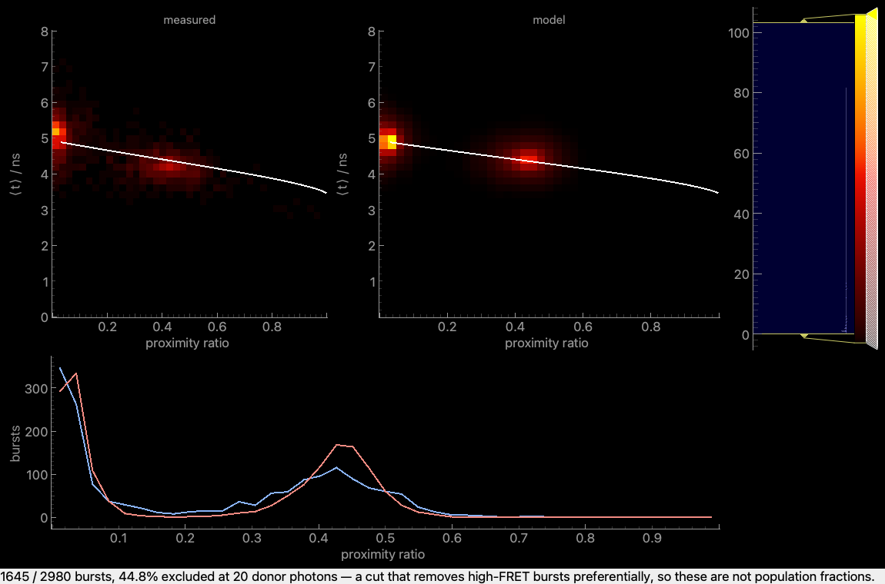

# Fitting an MFD burst histogram

**What you get:** a burst-analysis folder loaded as a fittable dataset, and a
kinetic model fitted to its FRET-efficiency-against-lifetime histogram — instead of
a static line drawn on top and eyeballed.

**What you need:** a burst-analysis folder (a `bi4_bur` directory of `.bur` tables)
and the TTTR measurements it points back into. No IRF file and no separately
measured correction factors: both the instrument response and the background rate
are taken from the measurement's own non-burst photons.

The theory is in [Fitting the 2D MFD histogram](../concepts/mfd_fitting.md); this
page is the workflow.

## 1. Load the folder

Choose **MFD** as the experiment and **MFD (burst folder)** as the reader, then
point it at the analysis folder — the one containing `bi4_bur`, or the `bi4_bur`
directory itself, or any `.bur` inside it. All three work.

Three settings are worth understanding before you press anything:

| Setting | What it does |
|---|---|
| **Donor / Acceptor** | Detector names as they appear in the `.bur` columns. Their channel definitions are *verified* against the count columns; a detector that fails is refused rather than used. |
| **Min donor photons** | Bursts below it are excluded, because the Gaussian kernel the model uses for `⟨t⟩` is not valid there. The model applies the identical cut. |
| **⟨t⟩ min / max** | The mean-micro-time axis, in nanoseconds. Bursts outside it are excluded and counted. |

The dataset reports what it dropped — typically 40–50% of bursts at a 20-photon
cut. That is expected, and it is shown rather than hidden.

```{note}
If the reader refuses a detector, its channel definition could not be reproduced
from the photons. An acceptor-excitation detector is usually a micro-time *window*
on the acceptor channels, and no detector name can convey which window — record the
detectors in the analysis manifest, or pass them explicitly through the API.
```

## 2. Fit the static model first

Add a fit with **MFD 2D (static)**. The static answer is what a dynamic one has to
beat, and starting kinetic makes it far too easy to explain static heterogeneity as
exchange.

Free, in roughly this order:

1. **donorOnly** and **alpha** — the donor-only population's position pins both.
2. **tauD0** — the donor-only population's `⟨t⟩` pins it.
3. **R1** — the FRET population's position.

Leave `sigma`, `gamma`, `R0` and `tauA` fixed to begin with. `sigma` in particular
is *not* a free broadening parameter: under the histogram source alone it will
happily absorb width that belongs to the kinetics.



The plot shows the measured histogram, the model's, and the proximity-ratio
marginal of both. The white curve is the static FRET line, drawn in the *same raw
coordinates* as the data — with the model's own corrections applied to it, so the
deviation you read off it is dynamics rather than a mis-set `γ`.

## 3. Read the width, not just the position

The position is easy to hit. What tells you whether the model is right is whether
it reproduces the **width** of the cloud, and the donor-only population is where to
look: it has no distance and no efficiency, so its width is shot noise and nothing
else.

If the model is narrower than the data there, something is wrong with the
background or the photon counts. If it is *wider*, the model has been given a
broadening parameter it should not have.

A FRET population broader than the model is the normal and interesting case: that
excess is heterogeneity — a distribution of distances, acceptor photophysics, or
exchange — and it is what the kinetic model exists to explain.

## 4. Add exchange

Switch to **MFD 2D (kinetic)**, which adds a rate matrix over the same states.
Adding or removing a state resizes the matrix with it.

The three regimes are worth recognising in the plot:

* **Slow** (far below one transition per burst) — indistinguishable from two static
  populations. If the fit lands here, the data does not support exchange.
* **Fast** (thousands per burst) — one averaged population, narrower than either
  state.
* **Intermediate** — bursts caught mid-exchange fill the space *between* the states
  and pull the cloud off the static line. That displacement is the signal.

## 5. Headless

Everything above runs without the GUI:

```python
from chisurf.core.fluorescence.mfd.fit import load_mfd_data, MfdModel
from chisurf.core.fluorescence.mfd.patterns import FretState, Optics

data = load_mfd_data("path/to/burstwise_All 0.1000#15", min_green_photons=20)
print(data.report())          # sources, detectors, exclusions, background rates

model = MfdModel(
    optics=Optics(r0=52.0, tau_d0=1.57, tau_a=3.0, sigma=6.0, alpha=0.03),
    states=[FretState(distance=54.4)],
    donor_only=0.394,
)
score = model.score(data)
print(score.score, score.n_points, score.summary)
```

For exchange, use `MfdKineticModel` with a `rate_matrix` in the shared
`K[target, source]` convention:

```python
import numpy as np
from chisurf.core.fluorescence.mfd.fit import MfdKineticModel

kinetic = MfdKineticModel(
    optics=model.optics,
    states=[FretState(distance=40.0), FretState(distance=70.0)],
    populations=[0.5, 0.5],
    donor_only=0.2,
    rate_matrix=np.array([[0.0, 800.0], [500.0, 0.0]]),   # Hz
)
```

## 6. Try it on data whose answer you know

You do not need a measurement to learn what the three regimes look like. The
simulator writes a real burst folder, so it goes through everything above:

```python
from chisurf.core.fluorescence.mfd.simulate import (
    SimulationParameters, rate_matrix_for, simulate_mfd)

parameters = SimulationParameters(
    n_bursts=3000,
    rate_matrix=rate_matrix_for("intermediate", mean_duration=2e-3),
)
simulated = simulate_mfd(parameters)
folder = simulated.write_folder("/tmp/mfd-demo")     # load this like any folder
print(simulated.truth)                                # what generated it
```

Regimes are named in **transitions per burst** — `"static"`, `"slow"`,
`"intermediate"`, `"fast"` — because a rate only means something next to a burst
duration. `simulated.true_responses()` hands back the declared instrument response
and background, which you can pass to `load_mfd_data(..., responses=...)` to separate
whatever you are testing from the contamination of the estimated one.

`examples/mfd_dynamics_timescales.py` runs all four regimes and fits each one back.
Bear in mind what it proves: the simulator shares its physics with the model, so it
is a **code** test. It shows the machinery is wired correctly, not that the physics
is right.

## Two things not to misread

**Amplitudes are not population fractions.** The donor-photon cut removes high-FRET
bursts preferentially — they put most of their photons in the acceptor channel — so
the histogram understates every high-FRET species. The fit is unaffected, because
the model histogram is cut identically, but the numbers you read off the picture
are not the mixture.

**Uncertainties do not come from this fit.** The summed deviance over marginals is
an M-estimator, not a likelihood: the same bursts appear in every marginal, so its
curvature reports errors that are too small. ChiSurf refuses to report them rather
than letting confidently narrow error bars look like success. Take them from the
burst-wise source or a bootstrap over bursts.

## See also

* [Fitting the 2D MFD histogram](../concepts/mfd_fitting.md) — the theory.
* [Accurate FRET](../concepts/accurate_fret.md) — where α, β, γ and δ come from.
* [Burst selection](../concepts/multidimensional_exploration.md) — producing the
  folder this guide starts from.
