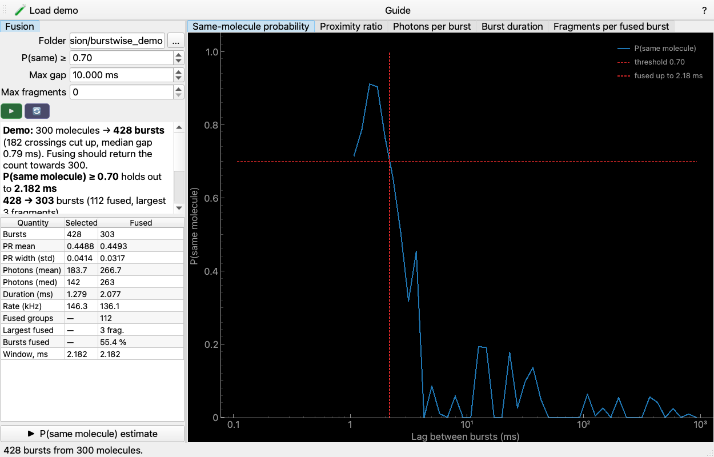
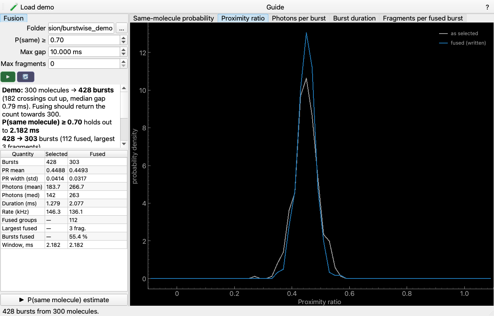

# Fusing bursts the same molecule produced

**What you get:** a burst folder in which one passage through the confocal spot
is one burst, instead of the two or three the burst search cut it into — and,
before you commit to it, a picture of exactly what that does to your proximity
ratio, your photon counts and your burst durations.

**What you need:** a burst-analysis folder (the one holding `bi4_bur`) and the
TTTR measurements it points back into. Fusion re-derives the fused burst table
from the photons, so the raw data must be readable — or nothing at all, if you
start with the built-in demo.

The theory — where the same-molecule probability comes from and why bridging a
gap costs something — is in [Burst fusion](../concepts/burst_fusion.md). This
page is the workflow.

## When you need it

Symptoms that a burst search has been splitting passages:

* a photon-count distribution with a heavy tail of short, dim bursts,
* a FRET histogram wider than the sample plausibly is,
* an H2MM or BVA analysis reporting dynamics at exactly the burst-search
  timescale.

Fusion is **optional** and it is not automatic: walking the burst pipeline past
it changes nothing until you write the fused folder.

## 0. Learn it on a measurement whose answer is known

Press **🧪 Load demo** in the toolbar. It simulates a measurement in which
**300 molecules** crossed the focus and about 60 % of those crossings were
interrupted — the molecule dimming for a fraction of a millisecond and coming
back — writes it as an ordinary photon file, and runs the *real* burst search
over it. The search turns those 300 molecules into about **430 bursts**.

That gap between 300 and 430 is the whole problem, stated as a number. The
status block keeps the 300 on screen, so every step below can be checked against
it rather than judged by eye. The demo is deliberately thin physics — one FRET
population, no diffusion model, no photophysics — because it exists to
demonstrate the fusion *decision*; anything measured on it is a statement about
the code, not about a molecule.

## 1. Open the step

In **Burst Analysis** it is step **3. Burst Fusion (optional)**, directly after
burst selection, and it inherits that step's output folder and detector
definition. Standalone, run the tool and pick the folder yourself.

The detector definition matters: the fused burst table is regenerated from the
photons, which needs to know which routing channels are "green" and "red". A
folder written by the current burst selection records this in
`Info/analysis.json` and nothing is asked of you. For an older folder, supply it
— the workflow's channel page does, and the CLI takes `--detectors` or
`--setup`.

## 2. Look at the curve before choosing a threshold

Press **🔄 Estimate** (beside the green Run). Nothing is written; the burst
tables are read and

$$
P_\text{same}(\tau) = 1 - 1/G(\tau)
$$

is estimated from the burst arrival times. The first plot is that curve.

Read it before you touch anything. It starts high — a burst arriving 100 µs
after another one is almost certainly the same molecule re-entering — and falls
as the lag grows and the molecule is replaced by fresh ones from the bulk. The
dashed line is your threshold; the dotted line is the lag actually fused up to.



On the demo the curve rises to about 0.9 near 1 ms — that hump *is* the split
crossings, pairs of bursts a millisecond apart far commoner than random arrivals
would explain — and is gone by a few milliseconds.

```{note}
The curve usually *dips* at the very shortest lags, and that is not a mistake:
nothing recurs faster than a burst is long, so the shortest bins hold
coincidences between different molecules and little else. The window is read
from the long end of the curve — the last lag still above the threshold.
```

## 3. Set the two controls

They answer different questions and both matter.

| Control | Question | How to choose |
|---|---|---|
| **P(same) ≥** | Is this the same molecule? | Start at 0.7. Try 0.9 (conservative — only obvious splits repaired) and 0.5, pressing 🔄 Estimate each time, and watch the summary table move. |
| **Max gap** | What does this cost? | Leave it at 10 ms unless you know why not. |

On the demo, whose truth is 300 molecules, the three thresholds tell the whole
story on one file:

| Threshold | Window | Bursts | Proximity-ratio width |
|---|---|---|---|
| 0.9 | 1.7 ms | 341 | 0.041 → 0.036 |
| **0.7** | **2.2 ms** | **303** | **0.041 → 0.033** |
| 0.5 | 2.7 ms | 283 | 0.041 → 0.031 |

0.9 leaves splits unrepaired; 0.7 lands on the truth; 0.5 goes *past* it, because
at this burst rate some genuinely different molecules also fall inside the
window. Note that the width keeps falling even where the burst count is already
wrong — narrower is not the same as better, which is why the mean matters too
(next section).

The second one deserves a paragraph. A burst on disk is one
`(first photon, last photon)` interval, so a fused burst is the span across its
fragments and **contains the photons between them**. On a dilute sample
`P_same` stays above 0.5 out to tens of milliseconds — the molecule really is
the same one, because there is hardly anyone else in the sample — and fusing on
that is correct about the molecule while putting tens of milliseconds of
background inside a burst. The ceiling is what keeps the step to the case it
exists for: a single passage the search cut in two.

When the ceiling is what bound the window, the status block says so, and the
summary's **Window, ms** row shows both numbers (what the probability allowed,
what was used).

## 4. Judge it from the summary, not from the burst count

The table beside the controls is the point of the tool. What a healthy fusion
looks like:

| Row | Expected | What it means if not |
|---|---|---|
| Bursts | falls | — |
| Photons (mean) | rises | — |
| PR width (std) | **falls** | the width was shot noise from fragments |
| PR mean | roughly unchanged | a moving mean means you are merging *populations*, not fragments — raise the threshold |
| Duration, ms (mean) | rises modestly | a rise of orders of magnitude means the gap ceiling is too generous |



The demo has **one** FRET population, so the width you see is entirely shot
noise — and putting the fragments back together removes a measurable part of it,
which is what the narrower blue curve is. On real data with several populations
the same narrowing happens *within* each peak, where it is easier to miss and
just as valuable.

The **Photons per burst** plot shows the same thing as a distribution: fusion
takes weight out of the short-burst tail, because the tail *was* the fragments.
The **Fragments per fused burst** plot shows how far chains ran; fusion is
transitive (A–B and B–C makes one burst of three), and a long tail there is the
signal to cap it with **Max fragments**.

## 5. Write the fused folder

Press **▶ Run** — on this step, running *is* fusing. This is the slow half: the photon streams are reopened and
every column is re-derived over the real span, so the result is an ordinary
burst folder — BVA, 2CDE, the MLE, H2MM and the browser read it with no idea
that fusion happened.

```
<source>_fused_p0.50/
  bi4_bur/<stem>.bur     the fused bursts, regenerated from the photons
  fu4/<stem>.fu4         per fused burst: fragments merged, background gained
  Info/analysis.json     how the raw data was read
  Info/fusion.json       the settings, the window, the curve, the statistics
```

Two things to know about the output:

* The plots switch from the preview to **what was actually written** (the legend
  says which). They differ by the background the bridged gaps brought in —
  `Fused Gap Photons` in the `fu4` companion is that number per burst,
  and it is worth a look before you build on the folder.
* The source folder is untouched, except for an optional `fg4` companion giving
  each original burst its fused-burst number — so you can colour the original
  bursts by their group in the browser or in ndX.

In the workflow, running the step is also what redirects the later steps: from
that point the pipeline analyses the fused bursts. Re-running burst selection
supersedes that and takes you back to un-fused bursts.

```{note}
Because fusion is optional, **Next** and the ⏩ fast-forward pass over this step
without running it. Walk past it and every later step keeps analysing the folder
burst selection produced; run it and they analyse the fused folder. Nothing
changes the bursts under your analysis unless you press the button.
```

```{warning}
Per-burst results already computed on the un-fused folder — BVA, 2CDE, MLE
lifetimes — are **not** carried over. They have one row per un-fused burst, and
a burst folder is merged column-wise *by position*, so copying them would
silently report one burst's lifetime against another's efficiency. Recompute
them on the fused folder; that is why fusion sits before those steps.
```

## Headless

```bash
# What would this threshold do? (writes nothing)
csc fusion curve "burstwise_All 0.1000#15" --threshold 0.5

# Write the fused folder
csc fusion fuse "burstwise_All 0.1000#15" --threshold 0.5 --max-gap 10 -o fused
```

`curve` prints the window, the burst counts and the before/after proximity ratio;
`--json` gives the full statistics for a scan over thresholds. `fuse` takes the
same options plus `--detectors channels.json` / `--setup <name>` for a folder
written before analyses recorded their own reading manifest.

From Python:

```python
from chisurf.plugins.burst.burst_fusion.api import FusionSettings
from chisurf.plugins.burst.burst_fusion.core import analyze, fuse_folder

result = analyze("burstwise_All 0.1000#15", FusionSettings(threshold=0.5))
print(result.statistics["n_bursts_before"], "->", result.statistics["n_bursts_after"])
print("fused gaps up to", result.tau_used_s * 1e3, "ms")

fuse_folder("burstwise_All 0.1000#15", FusionSettings(threshold=0.5))
```

The demo is available headlessly too, which makes it a convenient fixture for
trying settings without any data:

```python
from chisurf.plugins.burst.burst_fusion.demo import create_demo

demo = create_demo()          # cached after the first call
print(demo["truth"]["n_molecules"], "molecules ->", demo["bursts"], "bursts")
analyze(demo["folder"], FusionSettings(threshold=0.7))
```

## The method, and when *not* to fuse

The same-molecule probability is from **recurrence analysis of single particles**:

> Hoffmann, A., Nettels, D., Clark, J., Borgia, A., Radford, S. E., Clarke, J. &
> Schuler, B. (2011). *Quantifying heterogeneity and conformational dynamics from
> single molecule FRET of diffusing molecules: recurrence analysis of single
> particles (RASP).* **Phys. Chem. Chem. Phys.** 13(5), 1857–1871.
> [10.1039/c0cp01911a](https://doi.org/10.1039/c0cp01911a)

That paper reads the curve to *correlate* a recurring burst with the one before
it — deliberately keeping them apart — and so measures dynamics slower than a
transit. This step reads the same curve to *merge*. Both are right, for different
cases: a molecule that genuinely left and came back is RASP's subject, and fusing
it would destroy the very dynamics being measured; a passage the search cut in
half is fusion's. The gap ceiling is what keeps this step on the second case.
If slow dynamics are what you are after, use
[recurrence analysis](02_recurrence_rasp.md) and leave fusion alone.

Cite the paper for the method, and report the threshold and gap ceiling you used
— both are in the fused folder's `Info/fusion.json`.

## Related

* [Burst fusion](../concepts/burst_fusion.md) — the theory and the assumptions.
* [Recurrence analysis (RASP)](02_recurrence_rasp.md) — the same probability,
  used to read out slow dynamics instead of to merge bursts.
* [Photon burst identification](13_burst_identification.md) — the search whose
  splitting this repairs.
