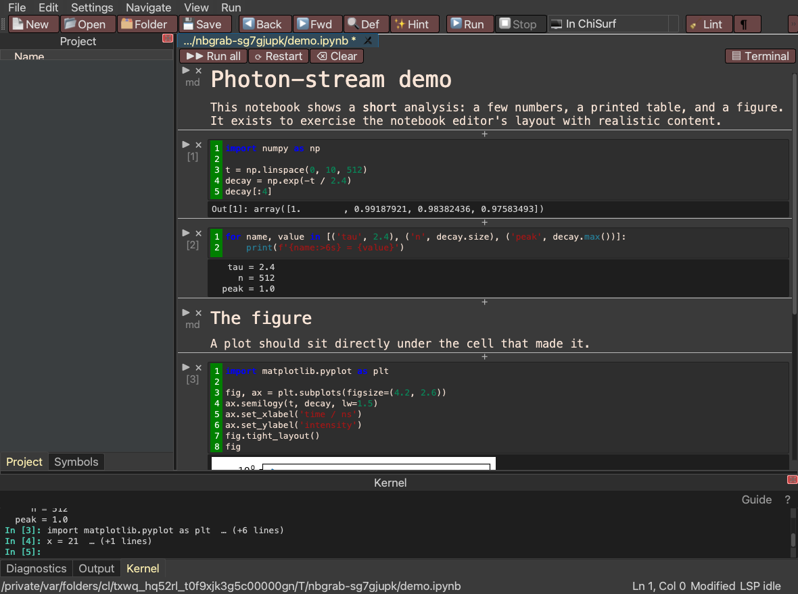

# Notebooks that run inside ChiSurf

**What you get:** an `.ipynb` that runs against *this* session — the same
`cs.fits`, the same loaded datasets, the same in-memory objects the windows are
drawing — with figures embedded under the cell that drew them, and a saved file
any Jupyter reader can open.

**What you need:** the Code Editor tool (`Tools → Miscellaneous → Code Editor`)
and a notebook. `File → Open Notebook` lists the ones ChiSurf ships under
`examples/notebooks`.

There is no Jupyter kernel and no browser here. A notebook tab executes its
cells through the same interpreter as the [console](59_console.md), so the two
share variables and there is nothing to synchronise or export.



## Running cells

`Ctrl+Enter` or `Shift+Enter` runs the cell the cursor is in, and the `▶` in
the cell's left gutter does the same. The `[n]` under it is the execution
count, shared with the Kernel dock — one kernel, two surfaces.

A cell's output appears directly under it and is **exactly as tall as what it
holds**: one line for one line, the whole figure for a figure. Output past
360px scrolls inside the cell rather than pushing the next cell off screen.

Markdown cells are shown rendered. Double-click one to edit it, `Ctrl+Enter` to
render it back.

## The toolbar

| Control | What it does |
| --- | --- |
| **▶▶ Run all** | Every code cell, top to bottom |
| **⟳ Restart** | Discards the kernel's variables; the cells keep their source and lose their prompts |
| **⌫ Clear** | Empties every output panel |
| **▤ Terminal** | Shows or hides the **Kernel** dock at the bottom of the window |

## Plots

`%matplotlib inline` is already on. A cell that draws a figure gets the PNG
embedded in its own output, scaled to the width of the cell — so a wide figure
shrinks rather than needing a sideways scrollbar. Ending a cell with `fig`
shows the image, not the figure's `repr`.

```python
import matplotlib.pyplot as plt

fig, ax = plt.subplots(figsize=(4.2, 2.6))
ax.semilogy(t, decay, lw=1.5)
ax.set_xlabel('time / ns')
ax.set_ylabel('intensity')
fig
```

The figure lives in the cell that produced it. It is not also painted into the
Kernel dock — that panel is for stream output and for commands you type there
yourself.

## The kernel terminal

The **Kernel** dock at the bottom of the window -- tabbed with Diagnostics and
Output, and movable like any other panel -- is a full prompt on the notebook's
kernel. Anything defined in a cell is available there and vice versa, which
makes it the natural place to poke at a variable mid-analysis without adding a
cell you will delete again.

Each notebook tab has its own kernel, so the dock follows the tab in front. A
tab that is not a notebook leaves it empty and disabled -- there is no kernel
to talk to.

When a cell runs, a one-line marker of its source is typed onto that prompt so
the log says *which* cell produced the output beneath it:

```
In [1]: import numpy as np  … (+3 lines)
In [2]: for name, value in [('tau', 2.4), …  … (+1 lines)
   tau = 2.4
     n = 512
```

## Adding and removing cells

`＋ Code` and `＋ Markdown` at the bottom append a cell. The hairline `＋`
between any two cells inserts one *there*. The `✕` in a cell's gutter deletes
it — including a rendered markdown cell, without opening it for editing first.

## Saving

`Ctrl+S` writes the tab back through `nbformat`, so cell metadata the notebook
arrived with survives the round-trip and the outputs currently on screen are
written into the file. A notebook that fails to parse opens as a plain text tab
instead, which is how you fix a corrupt one.

## Where this sits

The notebook tab is a widget of the code editor plugin
(`chisurf/plugins/core/code_editor/notebook_editor.py`), and the interpreter
behind it is `chisurf.core.console.shell.Shell` — the same class documented in
[Driving ChiSurf from its console](59_console.md). Every panel of that window,
Kernel included, is a `ChisurfDock`, so they move, float and tab together.
