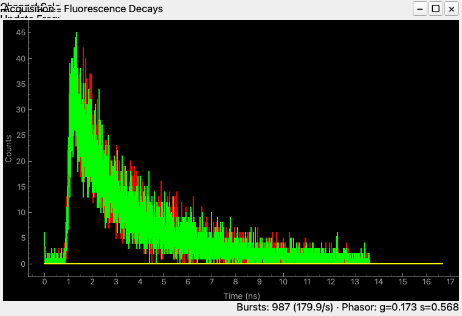
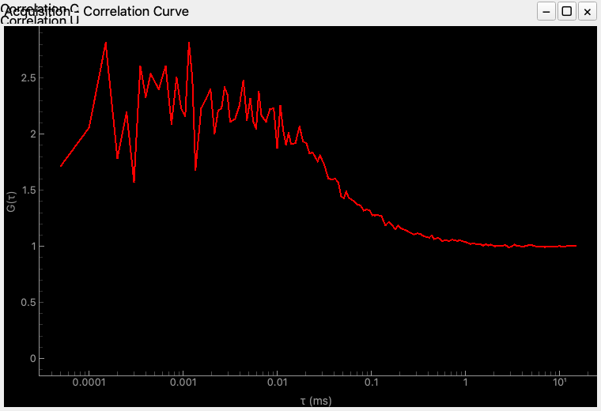
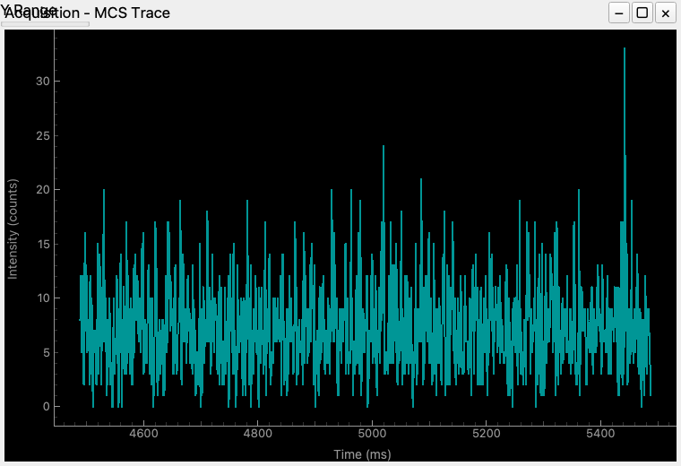

# Live acquisition: watching a measurement while it happens

**Main → Tools → Acquisition** streams photons from a TCSPC card — Becker &
Hickl SPC-130/150/160/180, PicoQuant, BrickMic — or from the built-in photon
simulator, and analyses them *while they arrive*: a decay per detector, an FCS
correlation, count rates, an MCS trace and inter-photon times, all updated per
chunk. Nothing here re-reads the photons it has already seen, so the display
costs the same at minute 30 as at minute 1 (see
{doc}`Streaming analysis </concepts/live_streaming_analysis>`).

You do not need hardware to follow this guide: **Simulation** is a full confocal
photon simulator — diffusion through a focus, FRET states, anisotropy,
photophysics — and produces the same B&H records a card does.

## Running one

1. Open **Setup → Settings → Acquisition** and pick the **device**. With
   *Simulation*, **Simulation Setup…** in the dock opens the simulator's
   parameters (species, brightness, diffusion, lifetimes, excitation mode).
2. Set the **stop conditions** in the dock: a time in seconds, a photon count in
   kilo-photons, or both. At least one is required — an acquisition with neither
   would never stop on its own.
3. Set the four **routing channels**. These are the detector numbers the card
   emits, and they are what the decay and count-rate windows are indexed by:
   window *i* shows channel *i* of that list, whatever the numbering.
4. Optionally set an **output folder**. On devices that support it, raw vendor
   words are written there during the run.
5. Press **Start**. The device is initialised on demand.

The status bar reports the stop reason when a condition is met, and the LCD next
to it is the mean count rate in kHz.

## What the windows show

**Fluorescence decays** — one micro-time histogram per routing channel,
identical to a `bincount` of the saved micro times. The x axis is nanoseconds
when the device states its TAC resolution, and TAC channels when it does not; it
is never a guess.



The line under the plot is two quality numbers that come free with the same
photon pass: the **burst count and rate** from a sliding-window burst search, and
the **phasor** (g, s) of all micro times. Both are diagnostics for alignment and
sample quality, not analyses — a phasor that drifts during a measurement is worth
knowing about before the measurement ends.

**Correlation curve** — up to four live FCS curves. Each is a channel pair from
the window's controller: the same channel twice is an autocorrelation, two
different channels a cross-correlation with the lag running from the first to the
second, and `-1` means *every* photon. The curve is the multi-tau correlator's,
computed incrementally and agreeing with the offline correlator on the same
photons.



**MCS trace** — the intensity trace at the configured bin width, showing the last
*rollaround* milliseconds. Only that window is kept, and it keeps its absolute
position on the time axis, so the trace scrolls rather than restarting.



**Count rate** — one point per chunk per channel plus their sum, in counts per
second, against macro time.

**Macrotime plot** — inter-photon times; a quick look at whether the stream is
Poissonian or structured.

## Saving

The live path analyses; it does not yet write a self-contained file. On devices
that drip raw vendor words, an **output folder** captures them and the run can be
re-analysed offline; without one, the photons reach the display and nowhere else,
and the status line says so when the run ends rather than implying a save. A
native `.pto` sink written *during* the measurement — clocks and channel map as
header tags, surviving a crash — is the tracked next step.

## Without a GUI

The pipeline is Qt-free and is the same object the GUI feeds. Push raw device
words at it and read display state back:

```python
import numpy as np
import tttrlib
from chisurf.plugins.core.acq.pipeline import AcquisitionPipeline, PipelineConfig

pipeline = AcquisitionPipeline(PipelineConfig(
    record_type=tttrlib.RECORD_SPC130,   # the device's record format
    macrotime_clock=50e-9,               # seconds per macro-time tick
    channels=(8, 0, 9, 1),               # routing channels, in window order
    correlation_pairs=((0, 8, 8), (1, 8, 0)),   # (curve, channel a, channel b)
    mcs_bin_width_ms=1.0,
    mcs_rollaround_ms=1000.0,
    photon_limit=1_000_000,
))

for chunk in device_chunks:              # uint32 records, as read from the FIFO
    pipeline.push(chunk)
    if pipeline.stop_reason:
        break

pipeline.flush()                         # the correlators emit their last bin
state = pipeline.snapshot()
tau_ms, g = pipeline.correlation(0)
decay = pipeline.decay(0)
```

`snapshot()` is plain data — histograms, curves, count rates, the burst count and
the phasor — and contains no photon arrays: everything in it is sized by the
configuration rather than by how long the acquisition ran.

To generate a stream to push, the simulator is one call:

```python
from chisurf.plugins.core.acq.tcspc_devices.simulation.core.algorithms import (
    generate_spc132_uint32,
)

words = generate_spc132_uint32({
    "N_ph_max": 50_000,
    "pulsed_exc": 1,
    "decay_lifetimes": [[1.0, 3.5]],     # amplitude, lifetime in ns
    "psf_type": "analytic_gaussian3d",
})
```

`psf_type` is one of `gaussian3d` (default), `analytic_gaussian3d` (the same
Gaussian evaluated on the fly, no voxel grid), `gaussian_lorentzian` (a confocal
detection volume whose waist expands with `psf_zR`) or `radial` (a measured
radially-symmetric focus, read from `psf_file`). The name selects the
constructor and nothing catches it: an unknown name, a `radial` without a
`psf_file`, or a photon library built without that grid all fail the call. None
of them falls back to the plain Gaussian, because a substituted focus changes
the answer without changing anything you can see.

## Related

- {doc}`Streaming analysis </concepts/live_streaming_analysis>` — why the live
  path is incremental, and where it is exactly the batch answer
- {doc}`Simulating photon streams </guides/18_tttr_simulation>` — the simulator
  on its own, for generating test data
- {doc}`Handling TTTR files </guides/12_handling_tttr_files>` — reading what was
  saved
