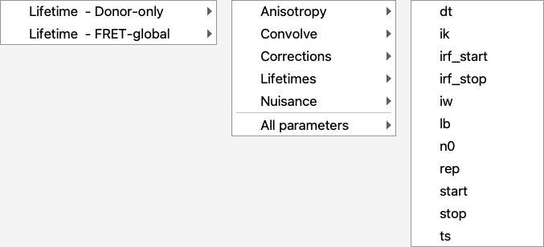

# Linking parameters

Linking makes one parameter *follow* another: the follower stops being a degree
of freedom and reads its value from the master. It is how a global analysis
shares one quantity across datasets — one lifetime, one correction factor, one
distance — and how a plugin's constant (an ndX calibration, for example) is tied
to the fits that should obey it.

A linked parameter disappears from the optimiser's free set but keeps its place
in the model, so the fit still reads its value. Refining the master updates every
follower.

## From the GUI

Right-click a parameter — in a fit's parameter panel, in a
[parameter table](plugins/index.md), or in the Global View — and open
**🔗 Link \<name\> to**.



The menu is a fit list, and under each fit its parameters:

* **One entry per fit.** A fit group holding several curves is expanded into its
  member fits, because each curve carries its own parameters.
* **Grouped as the model presents them** — *Convolve*, *Corrections*,
  *Lifetimes*, *Nuisance*, *Anisotropy* — and again flat under **All
  parameters**, sorted by name.
* Every parameter is a target except the one being linked, including a parameter
  of the *same name* in another fit. Linking `tau1` of one curve to `tau1` of
  another is the ordinary global-analysis case, and the menu addresses the target
  by identity, not by name.

A fit that has no parameters to offer says so instead of opening an empty
submenu. **Unlink** in the same context menu makes the parameter free again; it
is enabled only while the parameter is linked. Both work on parameters that
belong to no fit — an ndX calibration constant, a plugin's working model —
because each target is addressed by its UUID rather than by a name and a fit.

## Reading a parameter table

A table says at a glance which numbers the fit will move:

| Appearance | Meaning |
|------------|---------|
| upright, normal | free — the fit varies it |
| dimmed value | **fixed**, or linked: the fit will not move this number |
| *italic* row | **linked follower** — its value comes from its master, and the cell cannot be edited |

Hovering a follower's value names its master.

Recursive links are refused — a parameter cannot follow itself, directly or
around a cycle.

## From a script

At the object level, assign the master to the follower's `link`:

```python
import chisurf

donor, fret = chisurf.fits[0], chisurf.fits[1]
donor.model.parameters_all_dict["tau1"].link = fret.model.parameters_all_dict["tau1"]
```

Through the action layer, which records the operation in the
[history](../development/index.rst) projection:

```python
chisurf.core.actions.dispatch(
    name="parameter.link",
    payload={
        "source_fit_index": 0,
        "source_parameter": "tau1",
        "target_fit_index": 1,
        "target_parameter": "tau1",
    },
)
```

Over the [RPC server](ndxplorer_headless_cli.md), `parameter.link` accepts the
same addressing plus `parameter_uid` / `target_parameter_uid`, which is what lets
a parameter outside any fit — a plugin's working model — join the same link graph:

```python
client.call("parameter.link", {
    "parameter_name": "gamma",
    "target_parameter_uid": calibration_gamma_uid,
})
```

`parameter.unlink` (or `p.link = None`) reverses it.

## See also

* [FRET calibration](../guides/fret_calibration.md) — sharing one calibration
  across datasets.
* [Global View](plugins/globalview.md) — the link graph as a network, where links
  can also be made and removed.
