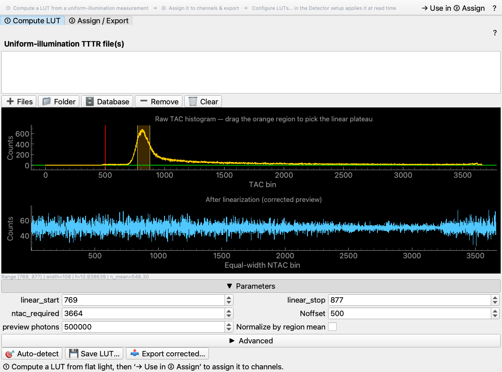
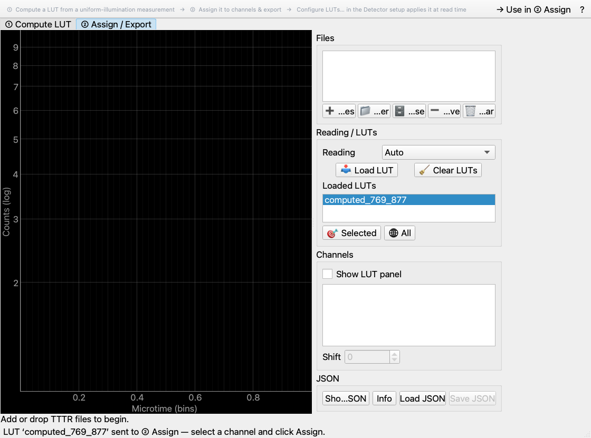
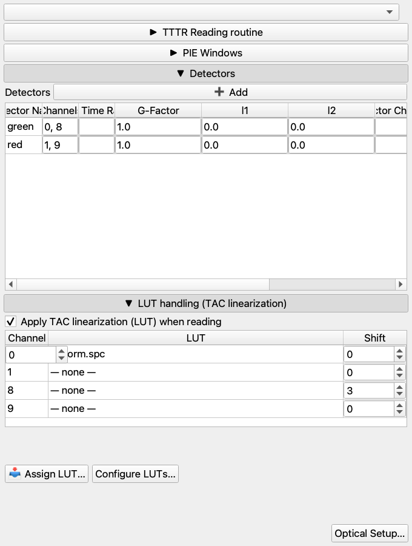
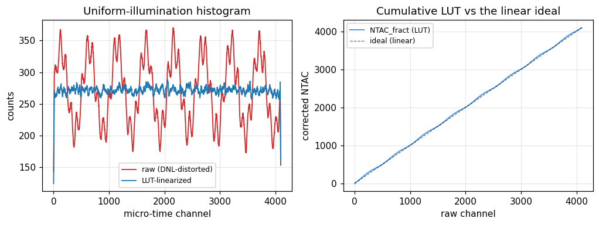

# TAC linearization: microtime LUTs

Some TCSPC hardware — notably Becker&Hickl **SPC-130** — records photon
micro-times on a TAC (time-to-amplitude converter) axis with visible
**differential non-linearity (DNL)**: the channels are not exactly equal in
width. Left uncorrected, every lifetime, FCS or PDA result built from those
micro-times is subtly distorted. ChiSurf fixes this with a per-routing-channel
**look-up table (LUT)** that you compute once from a flat-light measurement and
then apply automatically at read time.

## 1. Usage

### ① Compute a LUT

Open **Tools ▸ TTTR ▸ LUT Tools**. The header spells out the whole flow, and the
`?` button opens the full help. Work left-to-right through the two tabs.

On **① Compute LUT**, load one or more TTTR files of a **uniform-illumination**
(uncorrelated-light / scatter) measurement — light that *should* produce a flat
TAC histogram. Drag the orange region to mark the flat **linear plateau** (or let
it auto-detect), then press **→ Use in ② Assign** to hand the computed LUT
straight to the next stage (no need to save and reload a file).



### ② Assign it to channels



On **② Assign / Export**, add your measurement files (the used routing channels
are detected automatically), select a channel, and click **Assign**. Optionally
set a per-channel micro-time **shift**. **Save JSON** writes a portable
`settings.tttr.json` you can reuse on another setup or machine.

### Apply it in a detector setup

In the **Channel Definition** editor, the **LUT handling** box has a
**Configure LUTs…** button that opens the tool above; on close it pulls the
assigned `channel_luts` into the setup. Tick **Apply TAC linearization (LUT) when
reading** and the correction is applied to every read of that setup — the LUT
plot is shown on hover.



From then on, any reader that selects the setup linearizes photons at read time
through the single `staging.open_tttr` seam, so previews and production reads are
identical.

### Headless (CLI / API)

```bash
# ① compute a LUT from a flat-light file
chisurf lut-tools compute uniform.spc -o green.npy --routine SPC-130
# ② build a settings bundle assigning it to channel 0 (+ a 3-bin shift)
chisurf lut-tools settings --lut 0=green.npy --shift 0=3 -o settings.tttr.json
```

```python
from chisurf.plugins.tttr.tttr_lut_tools import api

tbl  = api.compute.compute_lut_from_files(["uniform.spc"], routine="SPC-130")
luts = {0: tbl["NTAC_fract"]}
# corrected micro-time histogram of channel 0
counts, axis = api.settings.corrected_histogram("data.spc", 0, luts, routine="SPC-130")
```

## 2. Concepts

A uniform-illumination measurement is the reference because it *should* be flat:
any structure in its TAC histogram is instrument DNL, not signal. The Felekyan
et al. (Rev. Sci. Instrum. 2005) construction reads the local counts as *bin
widths* — over-counted channels are "wide", under-counted ones "narrow" — and
integrates them into a cumulative table `NTAC_fract`. That table maps each raw
channel onto a corrected, equal-width axis; applying it (with stochastic
dithering, so no binning artifacts) flattens the histogram.



**Left** — the same flat-light photons before (red, wavy from DNL) and after
(blue, flat) linearization. **Right** — the cumulative LUT `NTAC_fract` departs
from the linear ideal (dashed) exactly where the TAC axis is non-linear; a
perfectly linear TAC would need no correction and the two lines would coincide.

The correction is **reproducible**: ChiSurf applies the LUT with a fixed dither
seed, so reading the same file twice yields the same decay. It is also
independent of the fit-model DNL correction (`correct_dnl`): the LUT fixes the
*data*, the model correction fixes the *model* — use one or the other, not both.

## Result

A per-channel LUT that turns a DNL-distorted TAC axis into a linear one, stored
in the detector setup and applied automatically at read time for lifetime, FCS,
burst and PDA analyses.

## See also

- Plugin: `chisurf/plugins/tttr/tttr_lut_tools/` (api / cli / backend / gui).
- Reading seam: `chisurf/core/fio/staging.py::open_tttr`.
- Channel definition: `chisurf/gui/widgets/wizard/tttr_channeldefinition/`.
- Felekyan et al., *Rev. Sci. Instrum.* 76.8 (2005) 083104.
